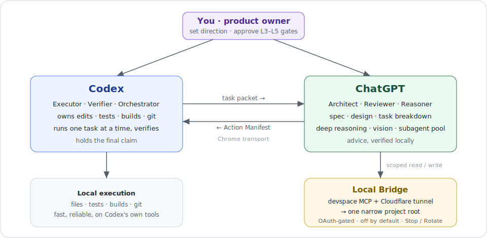

<h1 align="center">Codex ChatGPT Bridge</h1>

<p align="center">
  <strong>让 Codex 与 ChatGPT 安全地分工协作：ChatGPT 负责深度思考，Codex 掌控本地执行与验证。</strong>
</p>

<p align="center">
  <strong>省 Codex token</strong> ·
  <strong>ChatGPT 规划，Codex 执行</strong> ·
  <strong>本地执行可控、可改锁</strong>
</p>

<p align="center">
  <a href="https://github.com/Zhenyu98/codex-chatgpt-bridge/stargazers"></a>
  <a href="LICENSE"></a>
  
  
</p>

<p align="center">
  <a href="#适合谁">适合谁</a> ·
  <a href="#安装">安装</a> ·
  <a href="#路由模式">路由模式</a> ·
  <a href="#安全模型">安全模型</a> ·
  <a href="#常见问题">常见问题</a> ·
  <a href="README.md">English</a>
</p>

<p align="center">
  
</p>

让 Codex 和 ChatGPT 像两个协作代理一样分工：Codex 负责本地执行，ChatGPT 负责深度思考、审查和大上下文理解。

这个项目的目标很简单：

- 复杂问题交给 ChatGPT 想清楚。
- 本地改文件、跑测试、构建、git diff 仍由 Codex 执行。
- 大项目阅读和长日志分析尽量交给 ChatGPT，节省 Codex token。
- 本地 MCP 通道默认关闭，只在需要时打开，用完关闭。

## 适合谁

适合已经在使用 Codex，并且希望把 ChatGPT 作为强力协作代理的人：

- 想让 ChatGPT 帮忙读大项目，但不想把大量文件复制进 Codex 对话。
- 想让 ChatGPT 做架构审查、论文/硬件/复杂 bug 的第二意见。
- 想保留 Codex 对本地文件、测试、构建、git 的执行控制权。
- 想在安全边界内使用本地 MCP：窄暴露、用完即关、随时改锁。

## 工作方式

```text
用户任务
  ↓
Codex 判断任务类型和模式
  ↓
需要大上下文/深度推理时，把紧凑任务包发给 ChatGPT
  ↓
ChatGPT 通过本地 MCP 桥读取受限项目目录
  ↓
ChatGPT 返回 Action Manifest
  ↓
Codex 本地执行改动、测试和验证
  ↓
Codex 汇报结果和证据
```

默认分工：

- Codex 拥有写文件、跑测试、构建、git、最终验证。
- ChatGPT 拥有深度推理、大上下文阅读、视觉/PDF/截图分析和独立 review。
- 本地桥默认只暴露一个明确项目目录，并且默认只读。

## 安装

### 1. 克隆仓库

```powershell
git clone https://github.com/Zhenyu98/codex-chatgpt-bridge.git
cd codex-chatgpt-bridge
```

### 2. 安装 Codex skill

```powershell
powershell -ExecutionPolicy Bypass -File .\install.ps1
```

安装后 skill 会被复制到：

```text
%USERPROFILE%\.codex\skills\codex-chatgpt-bridge
```

安装完成后，重启 Codex 或刷新 skills 列表。

### 3. 检查本地环境

```powershell
$skill = "$env:USERPROFILE\.codex\skills\codex-chatgpt-bridge"
powershell -ExecutionPolicy Bypass -File "$skill\scripts\local_bridge.ps1" -Action Doctor
```

`Doctor` 会检查本地桥所需的 Node/npm、Git Bash、CLI 依赖等环境。

如缺少底层本地 MCP 桥 CLI，可按脚本提示安装：

```powershell
npm install -g @waishnav/devspace
```

如需要临时 HTTPS tunnel，脚本可自动下载 `cloudflared`：

```powershell
powershell -ExecutionPolicy Bypass -File "$skill\scripts\local_bridge.ps1" -Action Start -ProjectRoot <path> -Tunnel cloudflare -InstallCloudflared
```

## 启动和关闭本地桥

### 查看状态

```powershell
$skill = "$env:USERPROFILE\.codex\skills\codex-chatgpt-bridge"
powershell -ExecutionPolicy Bypass -File "$skill\scripts\local_bridge.ps1" -Action Status
```

### 启动临时通道

```powershell
powershell -ExecutionPolicy Bypass -File "$skill\scripts\local_bridge.ps1" -Action Start -ProjectRoot "D:\your\project" -Tunnel cloudflare -InstallCloudflared
```

启动后脚本会输出 `mcpUrl`。这个 URL 是 ChatGPT app 里要填写的 MCP 地址。

### 关闭通道

```powershell
powershell -ExecutionPolicy Bypass -File "$skill\scripts\local_bridge.ps1" -Action Stop
```

`Stop` 会关闭本地 MCP 服务和 tunnel，使 ChatGPT 无法继续访问项目目录。

注意：`Stop` 不会撤销 ChatGPT app 授权，也不会删除 app 配置。这样下次 `Start` 时可以复用同一个 ChatGPT app。

如果你在 ChatGPT 里手动断开 app 或 revoke OAuth，下次可能需要重新授权。

### 改锁 / Rotate（怀疑被别人连上时）

```powershell
powershell -ExecutionPolicy Bypass -File "$skill\scripts\local_bridge.ps1" -Action Rotate
```

`Rotate` 是“一键改锁”：停桥（清内存 token）→ 删除 `oauth-state.json`（吊销已签发的 token）→ 生成新的 Owner password。之后 `Start`，再用新密码重新授权你自己的 ChatGPT。任何“是不是被别人连了”的疑虑，跑它就对了。

## 让 ChatGPT 不用每次重新设置

如果想做到“平时关闭服务，用时打开；ChatGPT 端不用每次重建 app”，关键是使用稳定 URL。

推荐方案：

```text
ChatGPT app 固定 URL
  ↓
稳定 Worker / 自定义代理 / 稳定外部 tunnel
  ↓
当前本地 quick tunnel
  ↓
本地 MCP 服务
```

这样 ChatGPT app 里保存的是固定地址。每次本地重启后，只需要更新稳定代理背后的 upstream，而不需要重新创建 ChatGPT app。

不推荐长期使用裸 Quick Tunnel URL 作为 ChatGPT app 地址，因为它重启后可能变化。

## 在 ChatGPT 里创建 App

下面是通用流程。ChatGPT UI 可能会随版本变化，但核心配置项基本一致。

### 1. 打开开发者模式

在 ChatGPT 中进入：

```text
Settings → Apps → Advanced settings
```

打开 Developer mode。

### 2. 创建 App

进入：

```text
Settings → Apps → Manage → Create app
```

建议填写：

```text
Name: Codex ChatGPT Bridge
URL: 你的 mcpUrl，例如 https://your-stable-domain.example.com/mcp
Auth: OAuth
```

如果只是临时测试，也可以先填脚本输出的 Quick Tunnel `mcpUrl`。但下次重启 tunnel 后，可能需要改 URL。

### 3. 授权连接

ChatGPT 会打开授权页面。

只在你确认当前项目目录正确、暴露范围足够窄时继续授权。

不要把 owner password、token、OAuth secret、浏览器 cookie、API key 粘贴到公开聊天里。

### 4. 做只读 smoke test

授权后，先让 ChatGPT 做一个只读测试：

```text
请通过 Codex ChatGPT Bridge 打开当前 workspace，只列出顶层文件，不要写文件，不要运行修改性命令。
```

确认能读到正确项目目录后，再进行正式任务。

## 路由模式

### NORMAL

正常模式。ChatGPT 是强力 subagent，Codex 仍主动参与上下文理解和执行。

适合：

- 复杂实现任务
- 需要 Codex 一边改一边验证
- 希望 ChatGPT 给架构建议、审查和第二意见
- 质量和稳妥比省 token 更重要

例子：

```text
使用 codex-chatgpt-bridge 的 NORMAL 模式，让 ChatGPT 先 review 方案，再由 Codex 实现和测试。
```

### TOKEN_SAVING

省 token 模式。Codex 主要负责调度和执行，安全的阅读、分析、综合尽量交给 ChatGPT。

适合：

- 项目文件很多
- 日志很长
- PDF、截图、图纸、论文、硬件审查
- 想减少 Codex 对大上下文的阅读

例子：

```text
使用 codex-chatgpt-bridge 的 TOKEN_SAVING 模式。非必要不要让 Codex 大量读文件，让 ChatGPT 通过本地桥做只读审查，Codex 只执行和验证。
```

### CHATGPT_ARCHITECT

“规划反转”模式，适合长时间、连续的构建。ChatGPT 当架构师/经理（写 spec、设计、拆任务、为每个小任务生成提示、审查），Codex 每回合只做一个小任务并验证。

适合：

- 一个完整功能 / app / 游戏，先规划再逐步实现
- 想尽量省 Codex 配额、跑长会话不撞用量上限

要点：

- 按边际成本路由：只有当某块活能省下远超“一次慢速桥往返”的 Codex token 时，才交给 ChatGPT。
- 需要多 subagent 时，ChatGPT 可以直接充当 subagent 池，fan-out 不占 Codex 配额；Codex 始终是唯一的总控 + 集成 + 验证。
- 可选：你显式授予 `L3` 后，ChatGPT 可经桥直接写代码并自验证，Codex 只做集成 pass（读 diff + 跑测试），仍掌管 git 和最终结论。

例子：

```text
使用 codex-chatgpt-bridge 的 CHATGPT_ARCHITECT 模式。让 ChatGPT 先出 spec 和任务分解，再逐个把单任务提示交给 Codex 实现和验证。
```

## 权限等级

建议所有任务都从最低权限开始。

| 等级 | 含义 | 典型用途 |
|---|---|---|
| `L0_NO_TOOL` | ChatGPT 只拿 prompt，不访问本地 | 概念讨论、算法推理、写作 |
| `L1_READ_ONLY` | ChatGPT 可读受限 workspace | 代码审查、项目理解、文档审查 |
| `L2_DIAGNOSTIC_COMMANDS` | ChatGPT 可运行非修改性诊断命令 | `rg`、目录列表、`git status`、dry-run |
| `L3_WORKSPACE_WRITE` | 在受限 workspace 内写入 | 默认只写报告目录（`docs/chatgpt/`）；你把 ChatGPT 当独立 agent 时，可在窄 root 内写源码并自验证（不含安装依赖 / commit / push / 删除越界 / 密钥 / root 外） |
| `L4_PRIVILEGED_ROOT` | 管理员/root 操作 | 安装工具、硬件设备权限 |
| `L5_IRREVERSIBLE_EXTERNAL` | 不可逆外部动作 | force push、刷固件、下单、删除数据 |

`L4` 和 `L5` 默认必须人工审批。

## 安全边界

不要暴露：

- `.env`
- `auth.json`
- API key
- SSH key
- `id_rsa`
- `*.pem`
- 浏览器 cookie
- 整个 `C:\Users\<user>`
- 整个磁盘
- 无关私人文件夹

推荐暴露：

- 一个项目目录
- 一个仓库
- 一个明确任务

默认策略：

- ChatGPT 负责 review。
- Codex 负责写入和验证。
- 本地桥默认只读（这是**策略约定**，不是强制沙箱，见下）。

## 安全模型

要对信任边界诚实：一旦你给 ChatGPT app 过了 OAuth 授权，桥就授予了对你机器的文件读写和 shell 执行。`L0`–`L5` 只是 Codex 叮嘱 ChatGPT 遵守的**策略**，**不是沙箱**——`run_shell` 不受 root 约束，所以被授权的 app 实际上等于本地用户级代码执行。真正被强制的边界只有三条：OAuth 授权（一个强随机 Owner password）、文件工具的窄 `allowedRoots`、以及停桥。

实操建议：

- **不用时就 `Stop`**——常驻的公网端点是主要攻击面。
- root 要窄、不含密钥；要更强隔离就跑在最小权限账号或一次性 VM 里。
- 一旦怀疑别人连上，跑 `-Action Rotate` 吊销所有 token 并改锁。

## 面向 Agent 用户

想让 agent（Codex、Claude Code 等）替你安装配置，见 [agent-setup.md](agent-setup.md)：开头就是复制即用的提示词和安全默认。

## 常见问题

### 关闭后 ChatGPT 还会不会访问本地项目？

正常情况下不会。`Stop` 会关闭本地 MCP 服务和 tunnel。

但 ChatGPT 端可能仍保留 app 连接记录。这个记录本身不是本地通道；只有服务和 tunnel 重新打开时才可访问。

### 为什么不直接 revoke 授权？

因为 revoke 后下次可能需要重新授权。这个项目的目标是：

```text
平时关闭通道 → 使用时打开 → 用完关闭 → 不反复重配 ChatGPT app
```

### Quick Tunnel 为什么不适合长期配置？

Quick Tunnel URL 可能变化。适合测试，不适合作为长期 ChatGPT app URL。

想稳定复用，应使用 Worker/custom proxy 或其他稳定 URL。

### ChatGPT 能不能直接改源码？

不推荐。默认模式下，ChatGPT 应返回 Action Manifest；Codex 读取必要文件、应用补丁、运行测试并验证。

## 目录结构

```text
skills/codex-chatgpt-bridge/
  SKILL.md
  agents/openai.yaml
  scripts/local_bridge.ps1
  references/
    bridge-operations.md
    router-policy.md
    examples.md
    hook-design.md
    agents-snippet.md
```

## 路线图

- 更稳定的一键配置向导
- 更清晰的 ChatGPT app 创建截图/视频教程
- 可选的 pre-handoff 安全检查脚本
- 更完整的跨平台启动脚本
- 更多实际任务模板：代码审查、论文审查、硬件审查、复杂 bug

## 致谢

- This project builds on the open-source [DevSpace](https://github.com/Waishnav/devspace) project by Waishnav.
- Special thanks to [LINUX.DO](https://linux.do/) for providing a promotion platform.

## 许可证

[MIT](LICENSE)

## Star History

[](https://www.star-history.com/?repos=Zhenyu98%2Fcodex-chatgpt-bridge&type=date&legend=top-left)
